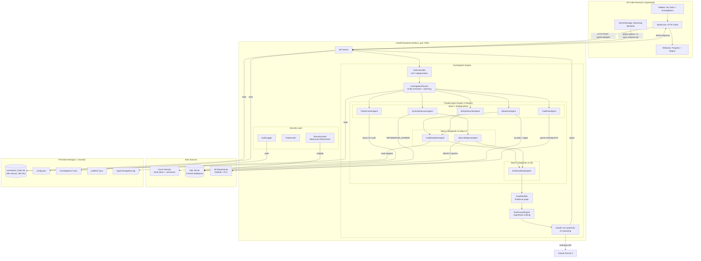

# TraceAI — System Architecture Report

---

## 1. Project Summary

### Problem
Developers spend 30-60% of investigation time manually tracing bugs across repositories, databases, and ticket systems. TraceAI automates this by combining code analysis, database introspection, and LLM reasoning into a single VS Code extension.

### Key Capabilities
- **AI-powered investigation** of bugs, features, incidents from Azure DevOps/Jira/GitHub
- **Multi-repository code analysis** across Oildroid (Android) + PLC (SaaS) with 29,064 indexed classes
- **Multi-tenant SQL intelligence** across 8 tenant databases with 362 foreign key relationships
- **3-wave parallel agent execution** reducing investigation time from 170s to 61s
- **Evidence-grounded reasoning** via Claude with strict confidence calibration
- **Apply Fixes** — Claude generates code patches shown in VS Code diff view

### Maturity Level
**Hybrid (Advanced Prototype → Early Production)**
- Core investigation pipeline: Production-ready
- Agent-based parallelism: Production-ready
- Workspace intelligence index: Production-ready (29K classes, 92K methods)
- VS Code extension UI: Production-ready (enterprise redesign)
- Multi-connector support: 2 active (Azure DevOps, SQL), 6 registered but unused
- Test coverage: Manual testing only, no automated test suite

---

## 2. System Architecture

### Components

| Component | Technology | Role |
|-----------|-----------|------|
| **VS Code Extension** | TypeScript, VS Code API | User interface — sidebar, webview panels, commands |
| **API Server** | Python, FastAPI, Uvicorn | REST backend on localhost:7420 |
| **Investigation Engine** | Python, LangChain | Core orchestrator — classification, planning, execution |
| **Agent Framework** | Python, asyncio | 8 parallel agents in 3-wave execution |
| **Workspace Index** | SQLite | Persistent code knowledge — 29K classes, 2K routes, 362 FKs |
| **Skill Registry** | Python | 8 modular analysis skills (code, SQL, logs, tickets) |
| **Connector Registry** | Python | 8 pluggable connectors (Azure DevOps, SQL, Jira, etc.) |
| **Security Layer** | Python, OS Keychain | Read-only enforcement, audit logging, credential management |
| **Claude LLM** | Anthropic API via LangChain | AI reasoning, root cause analysis, patch generation |
| **SQL Server** | Multi-tenant (8 DBs) | Production data for investigation context |
| **Azure DevOps** | REST API via Azure CLI | Ticket source — work items, comments, history |

---

## 3. Architecture Diagram



---

## 4. AI/ML Breakdown

| Component | Purpose | Input | Output | Runtime | Framework |
|-----------|---------|-------|--------|---------|-----------|
| **TaskClassifier** | Categorize task type | Task title + description | Category (bug/feature/performance/security/data_issue/integration), strategy, confidence | Server (Python) | Regex NLP (no ML model) |
| **EntityExtractor** | Extract key entities from text | Task title + description | Entity list (PascalCase, snake_case, acronyms) | Server (Python) | Regex NLP |
| **CodeFlowAnalysisEngine** | Trace execution paths | Source code files | LayerMap (Controller→Service→Repository→DB) | Server (Python) | Regex parsing (C#, Python, TS) |
| **RankedTableSelector** | Select relevant SQL tables | Entities + workspace index | Ranked table list (4-tier: code→index→FK→fuzzy) | Server (Python) | Heuristic scoring |
| **RootCauseEngine** | Rank root cause hypotheses | Investigation graph + evidence | Scored hypotheses | Server (Python) | Graph connectivity heuristics |
| **Claude LLM** | AI reasoning + report generation | Full evidence context (~10-50KB) | Structured JSON report with findings | Remote API | Anthropic Claude Sonnet 4 via LangChain |
| **Claude LLM (Patches)** | Generate code fixes | Investigation report + code context | File patches (original + patched) | Remote API | Anthropic Claude Sonnet 4 |

**Note**: No on-device ML models. All "AI" is either regex-based NLP (classification, entity extraction) or remote LLM calls (Claude). No TensorFlow, ONNX, or local inference.

---

## 5. Data Flow Analysis

### Happy Path (Investigation)

```
1. User clicks task in VS Code sidebar
   ↓
2. Extension opens webview with animated progress stages
   ↓
3. HTTP POST /api/investigate {task_id: "2410"}
   ↓
4. Server fetches task from Azure DevOps (Azure CLI token)
   ↓
5. TaskClassifier: "bug" → strategy: "error_hunt"
   ↓
6. InvestigationPlanner:
   - Extract entities: ["ITM", "dropdown"]
   - Detect tenant: "ck" → PLCMain_CK
   - Rank tables: 12 tables (rank 1 from workspace index)
   ↓
7. Wave 1 (parallel, ~35s):
   - RepoScanAgent: scan 200 files → 100 matches
   - SchemaDiscoveryAgent: query INFORMATION_SCHEMA → 95 tables
   - CodeFlowAgent: parse C# → 79 nodes, 29 edges
   - TicketContextAgent: search ADO → related tickets
   - EntityExtractionAgent: entities + action keywords
   ↓
8. Wave 2 (parallel, ~20s):
   - CodeDeepDiveAgent: read 150 files, extract code flows
   - SQLIntelligenceAgent: generate 20 queries, execute 12
   ↓
9. Wave 3 (~2s):
   - EvidenceMergeAgent: merge all → quality: "good" (70/100)
   ↓
10. GraphBuilder: 80 nodes, 4 edges
    ↓
11. RootCauseEngine: rank hypotheses by connectivity
    ↓
12. Claude LLM: send ~30KB context → receive structured JSON (~60s)
    ↓
13. Report saved to ~/.traceai/investigations/<uuid>.json
    ↓
14. JSON response → webview renders report
```

### Edge Cases

| Scenario | Handling |
|----------|----------|
| **SQL Server unreachable** | `_sql_unreachable` flag set on first failure → all subsequent SQL attempts skip instantly (fail-fast) |
| **Azure DevOps timeout** | 60s timeout per skill → graceful degradation, investigation continues without ticket context |
| **LLM tool calling fails** | PDI AI Gateway rejects tools → direct analysis mode (no tools sent) |
| **LLM completely fails** | Partial report generated from skill evidence only |
| **Entity extraction noise** | Stop words filter (30+ generic terms), min length 4, acronym preservation |
| **Investigation cancelled** | VS Code cancellation token → progress callback stops, partial results discarded |

---

## 6. State of the System

### Working (Production-Ready)

| Component | Status | Evidence |
|-----------|--------|----------|
| Investigation pipeline | ✅ | 61-125s end-to-end, 6-10 findings per investigation |
| Agent-based parallelism | ✅ | 3 waves, 10 tasks, 0 failures in testing |
| Workspace intelligence index | ✅ | 29,064 classes, 92,064 methods, 2,107 routes indexed |
| Schema relation builder | ✅ | 1,000 tables, 15,666 columns, 362 FKs |
| Ranked table selection | ✅ | 4-tier ranking eliminates 95-table fuzzy noise |
| SecurityGuard SQL enforcement | ✅ | 13/13 security tests pass, all SQL validated |
| Entity extraction (improved) | ✅ | Filters noise: `['ITM','dropdown']` not `['cr84899','follow','prod']` |
| Enterprise UI | ✅ | Progress view with SVG icons, concise report with type chip |
| Apply Fixes | ✅ | Claude generates patches, opens in diff/new-file view |
| Audit telemetry | ✅ | 6 event types logged to investigation.log |
| Azure DevOps connector | ✅ | All work item types fetched (including SWAT cases) |
| SQL fail-fast | ✅ | Unreachable SQL skipped instantly after first failure |

### Partially Implemented

| Component | Status | Gap |
|-----------|--------|-----|
| Code snippet injection | ⚠️ | Reads 40 lines per class — may miss deep logic in large files |
| Affected files accuracy | ⚠️ | Claude still sometimes lists investigation artifacts despite prompt instructions |
| History investigation view | ⚠️ | Opens in Beside column but webview may fail silently |
| SSE progress streaming | ⚠️ | Backend emits events but extension uses blocking POST with animated stages |
| Multi-connector support | ⚠️ | 8 connectors registered but only 2 active (Azure DevOps, SQL) |

### Missing

| Component | Impact |
|-----------|--------|
| Automated test suite | No unit/integration tests — all testing is manual |
| CI/CD pipeline | No automated build, test, or deployment |
| Method body parsing | Index stores method names but not implementations |
| Call graph analysis | No tracing of method-to-method calls |
| Git history integration | No commit analysis, blame, or diff integration |
| Incremental indexing | Full re-index on stale (>24h) — no delta updates |
| Auto workspace detection | Manual JSON config required for repos/services |

---

## 7. Weak Points

### Architecture Risks

| Risk | Severity | Description |
|------|----------|-------------|
| **Single LLM dependency** | HIGH | Entire reasoning depends on Claude API availability. No fallback LLM. |
| **Regex-based code parsing** | MEDIUM | Misses complex patterns (generics, lambdas, dynamic dispatch). No AST. |
| **No test coverage** | HIGH | Any refactor risks breaking the pipeline silently. |
| **Monolithic engine.py** | MEDIUM | 1,755 lines — hard to maintain, test, or extend. |
| **Workspace index staleness** | LOW | 24h TTL means recent code changes may not be indexed. |

### Scalability Issues

| Issue | Impact |
|-------|--------|
| SQLite workspace index | Single-writer, no concurrent investigations |
| File-based investigation storage | No search, no aggregation across investigations |
| In-memory investigation graph | Lost after each investigation, no persistence |
| Sequential LLM call | 60-80s per investigation, cannot be parallelized |

### Data Inconsistencies

| Issue | Description |
|-------|-------------|
| Entity extraction noise | Generic words like "list", "open", "data" match hundreds of classes |
| Affected files accuracy | Claude lists investigation artifacts instead of files needing changes |
| Stale workspace index | Code changes within 24h not reflected in index |
| Tenant DB routing | Relies on text matching ("CK" → PLCMain_CK) — fragile |

---

## 8. Improvement Suggestions

### Short-Term (1-2 weeks)

| Fix | Impact | Effort |
|-----|--------|--------|
| Add automated tests for agents, planner, security guard | Prevents regressions | Medium |
| Split engine.py into smaller modules (context_builder, llm_runner) | Maintainability | Medium |
| Add incremental workspace indexing (git diff-based) | Freshness | Low |
| Cache LLM responses for identical tasks | Speed | Low |
| Add retry logic for Claude API failures | Reliability | Low |

### Long-Term (1-3 months)

| Evolution | Impact | Effort |
|-----------|--------|--------|
| **AST-based code parsing** (Roslyn for C#, tree-sitter for multi-lang) | Accuracy | High |
| **Call graph analysis** — trace method-to-method execution paths | Deep understanding | High |
| **Multi-LLM support** — fallback to GPT-4 or local models | Resilience | Medium |
| **Investigation learning** — use past investigations to improve future ones | Quality | High |
| **Real-time SSE streaming** — true progress from backend to UI | UX | Medium |
| **PostgreSQL backend** — replace file-based storage for search/aggregation | Scale | Medium |
| **Git integration** — blame, diff, commit history in evidence | Context | Medium |
| **Auto workspace detection** — scan VS Code workspace folders automatically | Onboarding | Low |

---

## Appendix: Codebase Metrics

```
Total Files:     152 (143 Python + 9 TypeScript)
Total LOC:       17,905 (14,782 Python + 3,123 TypeScript)
Commits:         30+ on feature/testtrace
Branch:          feature/testtrace
Latest Commit:   041cd00
Workspace Index: 10.5 MB SQLite (29,064 classes, 92,064 methods)
Investigations:  3 stored reports (53-96 KB each)
Config Files:    4 JSON (config, workspace_profile, system_map, credentials)
```
